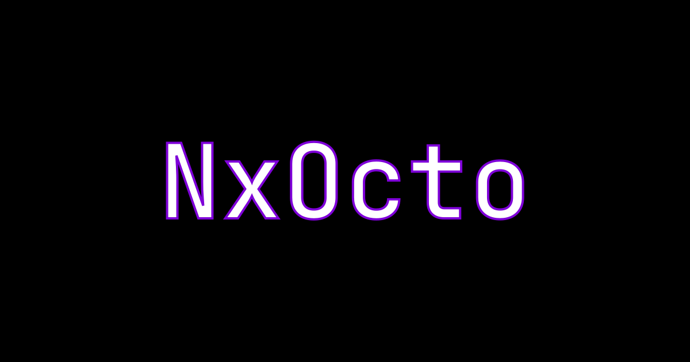

# NxOcto

<p align="left">
  
</p>

> AI-maintained utilities for Next.js projects. Plug-and-play TypeScript tools designed for automated development and easy integration.

Auto-run utilities for Next.js projects with built-in image optimization, reference updates, and more. This repository is maintained through AI-assisted development, making it easy to add new features while keeping code quality high.

## Features (Eternally WIP)

### 🖼️ Image Converter
- Convert images to modern web formats (WebP, AVIF)
- Automatic reference updates in code files (TS, JS, CSS, HTML, MD, JSON)
- Batch processing of entire directories
- Original file handling: keep, delete, or archive
- Configurable quality settings

### 🔧 SVG Optimizer
- Optimize SVG files using SVGO
- Precision control for numeric values
- Multipass optimization for maximum savings
- Batch processing of entire directories
- Original file handling: keep, delete, or archive

## Installation

Clone the repository and install dependencies:

```bash
git clone https://github.com/advaithkrishnaa/nxocto.git
cd nxocto
pnpm install
pnpm build
```

### Make it globally available

Link the CLI globally so you can use `nxocto` from anywhere:

```bash
pnpm link --global
```

Now you can run commands from any directory:

```bash
nxocto convert-images ./images --output ./optimized
```

Without linking, use the full path:

```bash
node dist/src/cli.js convert-images ./images --output ./optimized
```

## Quick Start

### Basic Image Conversion

```bash
# Convert images to WebP
nxocto convert-images ./images --output ./optimized

# Convert to AVIF with custom quality
nxocto convert-images ./images --output ./optimized --format avif --quality 85
```

### SVG Optimization

```bash
# Basic optimization
nxocto optimize-svg ./icons

# With custom precision
nxocto optimize-svg ./public/icons --output ./public/optimized --precision 1
```

> Note: If you haven't run `pnpm link --global`, use `node dist/src/cli.js` instead of `nxocto`

### With Reference Updates

Automatically update image references in your code:

```bash
nxocto convert-images ./public/images --output ./public/optimized --refs ./src,./pages
```

This will:
1. Convert all images in `./public/images` to WebP
2. Save converted images to `./public/optimized`
3. Update all references in `./src` and `./pages` to point to the new files

### With Original File Management

```bash
# Archive originals (with confirmation)
nxocto convert-images ./images --output ./optimized --archive ./archive

# Delete originals (with confirmation)
nxocto convert-images ./images --output ./optimized --delete

# Skip confirmation for automation
nxocto convert-images ./images --output ./optimized --delete --yes
```

## CLI Reference

### convert-images

Convert images to modern web formats.

```bash
nxocto convert-images <source-folder> [options]
```

**Options:**
- `--output <folder>` - Output folder for converted images
- `--refs <folder1,folder2>` - Comma-separated folders to update references in
- `--format <webp|avif>` - Output format (default: webp)
- `--quality <1-100>` - Quality setting (default: 80)
- `--delete` - Delete original files after conversion (prompts for confirmation)
- `--archive <folder>` - Move original files to archive folder (prompts for confirmation)
- `--yes, -y` - Skip confirmation prompts (for automation)

**Examples:**

```bash
# Basic conversion
nxocto convert-images ./images --output ./optimized

# With reference updates
nxocto convert-images ./public/images --refs ./src,./pages --output ./optimized

# Archive originals
nxocto convert-images ./images --archive ./archive --output ./optimized

# Automated workflow (no prompts)
nxocto convert-images ./images --delete --yes --output ./optimized
```

### optimize-svg

Optimize SVG files for smaller size.

```bash
nxocto optimize-svg <source-folder> [options]
```

**Options:**
- `--output <folder>` - Output folder for optimized SVGs
- `--precision <number>` - Decimal precision for numeric values (default: 2)
- `--no-multipass` - Disable multipass optimization
- `--refs <folders>` - Folders to update references in
- `--delete` - Delete original files after optimization (prompts for confirmation)
- `--archive <folder>` - Move original files to archive folder (prompts for confirmation)
- `--yes, -y` - Skip confirmation prompts (for automation)

**Examples:**

```bash
# Basic optimization
nxocto optimize-svg ./icons

# With custom precision and output
nxocto optimize-svg ./public/icons --output ./public/optimized --precision 1

# Archive originals
nxocto optimize-svg ./icons --archive ./archive --output ./optimized
```

## Programmatic Usage

You can also use NxOcto programmatically in your Node.js scripts:

```typescript
import { convertImagesInFolders } from './src/features/image-converter/imageConverter';

// Convert with all options
const results = await convertImagesInFolders(
  './images',              // source folder
  './optimized',           // output folder (optional)
  ['./src', './pages'],    // reference directories to update (optional)
  'webp',                  // format: 'webp' or 'avif' (default: 'webp')
  80,                      // quality: 1-100 (default: 80)
  false,                   // delete originals (default: false)
  './archive',             // archive folder (optional)
  false                    // skip confirmation (default: false)
);

// Check results
results.forEach(result => {
  if (result.success) {
    console.log(`✓ ${result.inputPath} → ${result.outputPath}`);
    console.log(`  References updated: ${result.referencesUpdated}`);
    console.log(`  Original: ${result.originalHandled}`);
  } else {
    console.error(`✗ ${result.inputPath}: ${result.error}`);
  }
});
```

## Development

### Setup

```bash
# Install dependencies
pnpm install

# Build the project
pnpm build

# Run tests
pnpm test

# Development mode (watch for changes)
pnpm dev
```

### Manual Testing

Generate test fixtures with sample images and code files:

```bash
pnpm generate-fixtures
```

This creates a `test-fixtures/` directory with sample data. Then try:

```bash
nxocto convert-images test-fixtures/images --output test-fixtures/output --refs test-fixtures/code
```

See `test-fixtures/README.md` for more examples.

### Running Tests

```bash
# Run all tests
pnpm test

# Run only unit tests
pnpm test:unit

# Run only CLI tests
pnpm test:cli
```

## Project Structure

```
nxocto/
├── src/
│   ├── features/              # Feature modules (one per feature)
│   │   └── image-converter/   # Image conversion feature
│   ├── cli.ts                 # CLI entry point
│   ├── index.ts               # Main exports
│   └── types.ts               # Shared TypeScript types
├── tests/                     # Automated tests
├── scripts/                   # Utility scripts
├── .ai/rules/                 # AI development guidelines
└── test-fixtures/             # Generated test data (gitignored)
```

See `CONTRIBUTING.md` for detailed structure and development guidelines.

## AI-Maintained Repository

This project is designed for AI-assisted development:

- **Automated feature additions** - AI agents can add new features following established patterns
- **Consistent code quality** - Guidelines in `.ai/rules/` ensure consistency
- **Self-documenting** - Each feature includes its own documentation
- **Comprehensive testing** - Automated tests for all functionality

Want to contribute? Check out `CONTRIBUTING.md` for guidelines on adding new features.

## Roadmap

Future features planned:
- PDF optimization
- SVG minification
- Font subsetting
- Asset bundling
- And more...

## License

MIT

## Contributing

Contributions are welcome! This project follows a structured approach to make it easy for both AI agents and human developers to add features.

See [CONTRIBUTING.md](CONTRIBUTING.md) for detailed guidelines.

## Support

- 📖 Documentation: Check feature READMEs in `src/features/`
- 🐛 Issues: Open an issue on GitHub
- 💡 Feature requests: Open an issue with the "enhancement" label
